# Lab2Web
## PRAKTIKUM HTML 2 LANJUTAN

### MEMBUAT PROFIL HALAMAN SEMANTIC DENGAN MEDIA DAN INPUT
Ini adalah Hasil dari Tampilan Web Saya
Restu Aji Prasetyo
312510034
# Menambahkan Foto
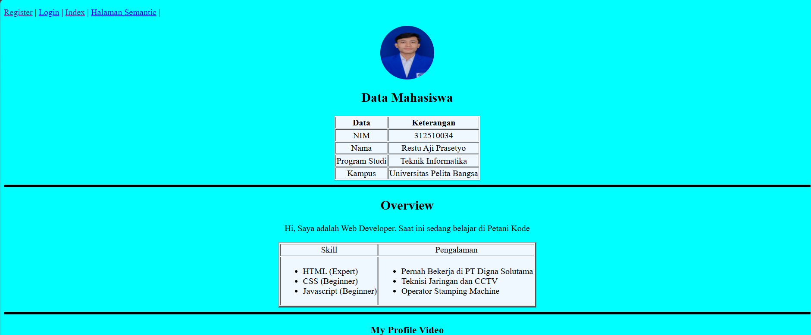
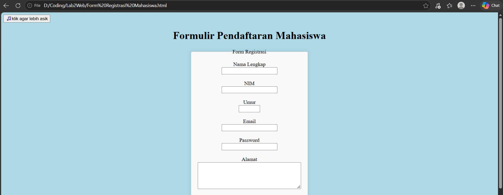
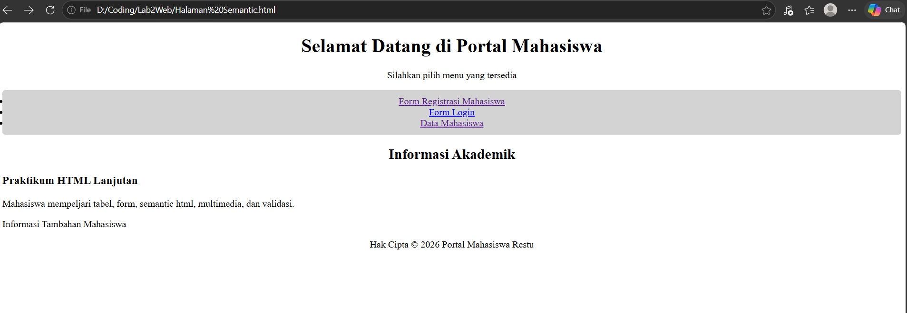
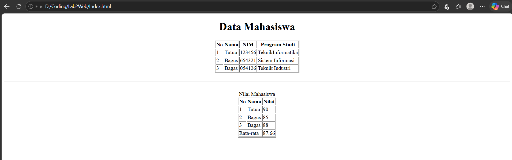
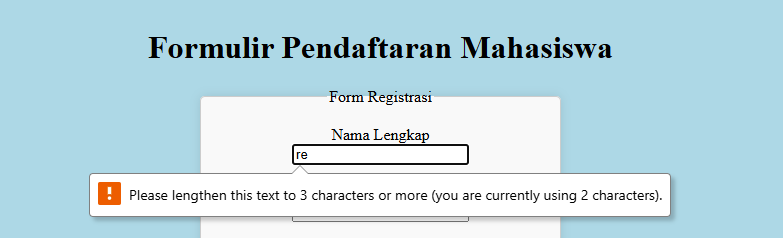
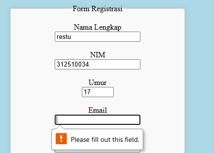
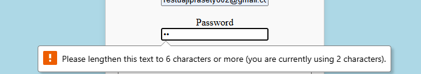
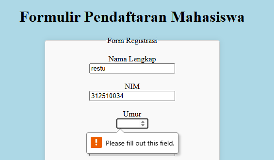
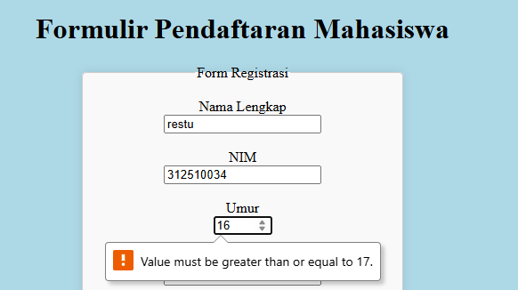

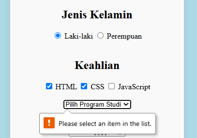
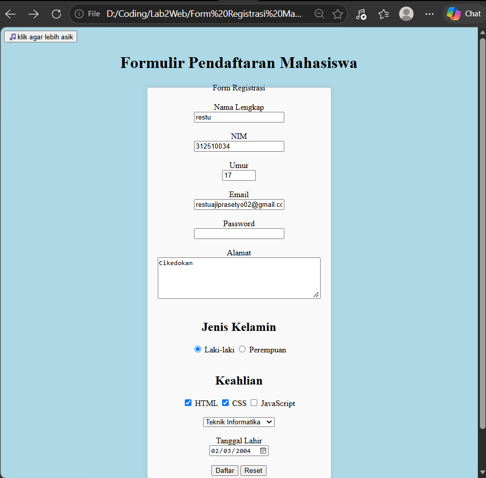
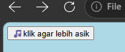
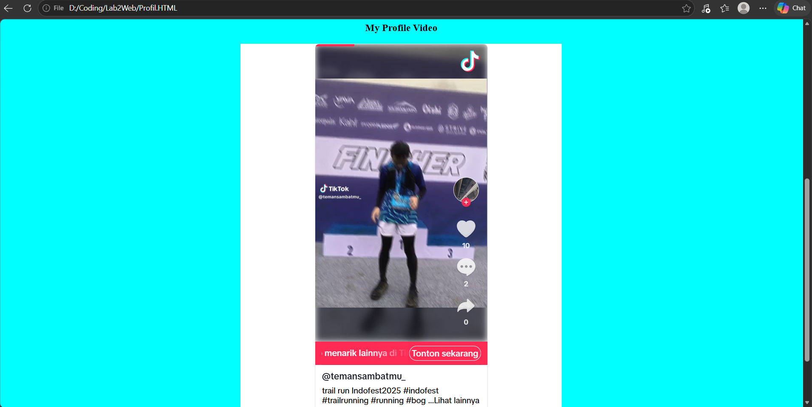